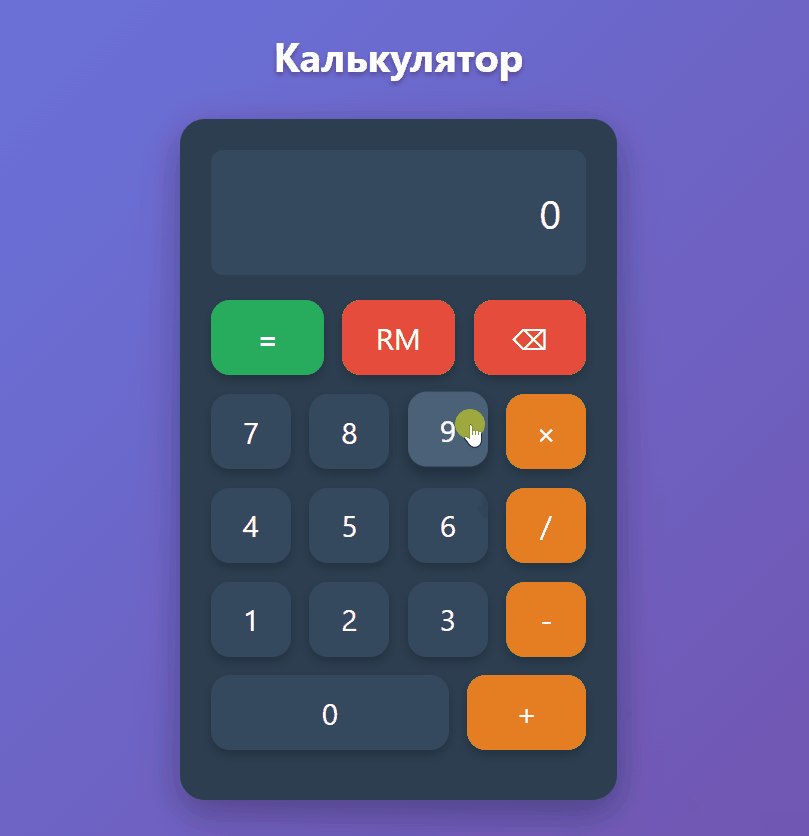
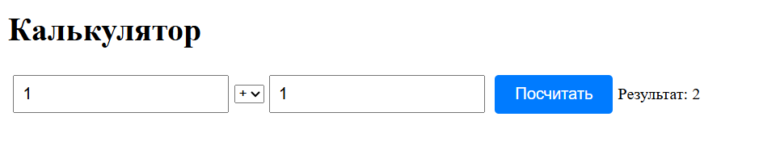

# JS Calculator

Калькулятор на чистом JavaScript с итеративным развитием функционала.

<!-- AUTOGENERATED_SECTION START -->
## 📋 История версий

### 🟢 v2.3.0

**Демо работы**  

**Функционал:**
- Нормализация чисел: автоматически исправлять 0123 → 123
- Нормализация операторов: заменять ++, +- на последний оператор

**Релиз:** https://github.com/ione-chebkn/js-calculator/releases/tag/v2.3.0

---

<!-- AUTOGENERATED_SECTION END -->

### 🟢 v2.1.0

**Демо работы**  

**Функционал:**

-   Обновлен дизайн до базового доступны (\*, /)

**Релиз:** https://github.com/ione-chebkn/js-calculator/releases/tag/v2.1.0

### 🟢 v1.0.0

**Демо работы:**  

**Функционал:**

-   Текстовые поля для ввода двух чисел
-   Выбор операции из списка
-   Отображение результата

**Релиз:** https://github.com/ione-chebkn/js-calculator/releases/tag/v1.0.0
